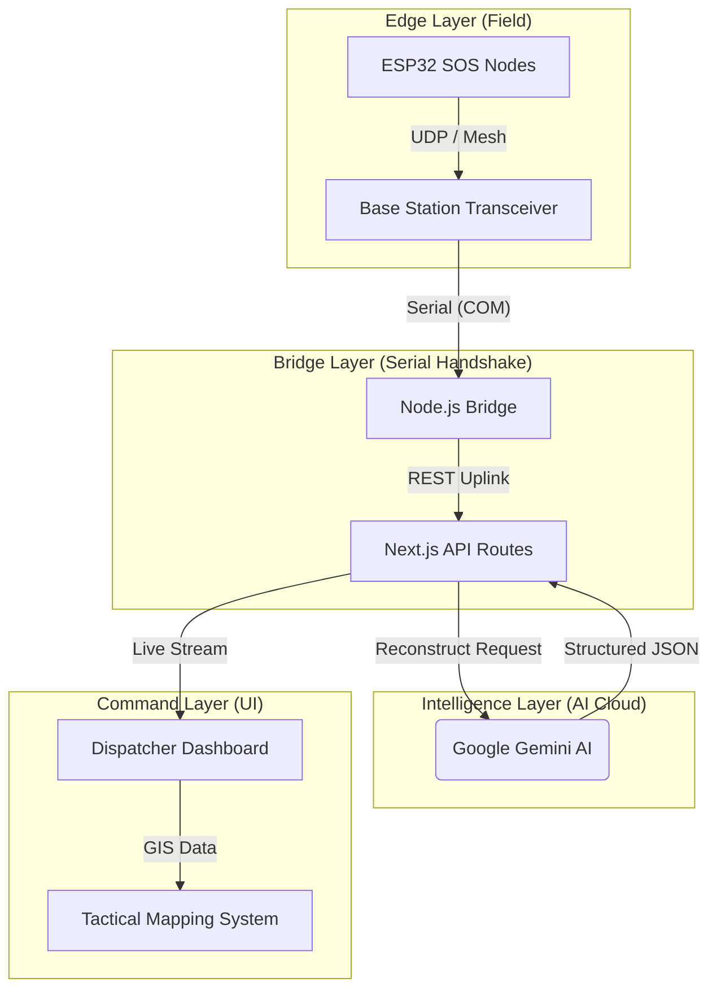

# 🛰️ Aerolink Basecamp: Tactical AI Command Center

> **Next-Generation Emergency Response Platform with AI-Driven Signal Reconstruction & GIS Intelligence.**

Aerolink Basecamp is a professional-grade dispatcher portal designed to handle low-power, fragmented emergency signals from the field. By combining proprietary **ESP32 SOS Hardware** with **Generative AI (Gemini)**, the system bridge the gap between unstable analog transmissions and high-fidelity rescue operations.

---

## 🛠️ System Architecture

Aerolink follows a robust, four-tier architectural model designed for maximum reliability in high-stress disaster environments.



---

## 🧠 Core Intelligence Features

### 📡 ML-Driven Signal Reconstruction
In disaster zones, signals are often noisy and fragmented due to distance or hardware limitations. Aerolink integrates **Google Gemini 2.0 Flash** to perform real-time signal restoration:
- **Heuristic Cleansing**: AI analyzes fragmented packets and reconstructs raw transmissions into professional, actionable intelligence.
- **Multimodal Context**: The AI considers victim names and manual location strings to verify the signal's authenticity and context.

### ⚖️ Automated AI Triage (Priority Board)
Not all emergencies can be attended to simultaneously. Aerolink features a proprietary **PriorityBoard**:
- **ML Scoring**: A specialized ML model analyzes every incoming ticket to generate a dynamic **Urgency Score (1-10)**.
- **Dynamic Scheduling**: The dashboard automatically rearranges field resources based on AI-assessed risk factors (Trauma, Fire, Drowning).
- **Resource Allocation**: Dispatchers are presented with a prioritized queue, ensuring critical lives are addressed first without human bottlenecking.

---

## 🗺️ Tactical GIS Intelligence

- **Situational Mapping**: Driven by `pigeon-maps`, the dashboard provides a high-resolution, interactive tactical layer including:
    - **Real-Time Anchoring**: Automatic Base Station anchoring via browser Geolocation.
    - **Distance Tracking**: Precise Haversine-based distance calculations between Command and the Victim.
    - **GIS Controls**: Integrated D-Pad navigation and full-modal map expansion for high-level "big picture" visibility.

---

## 💻 Technical Stack

- **Framework**: [Next.js 16](https://nextjs.org) (App Router, Turbopack)
- **Language**: TypeScript (Strict Type Safety)
- **Aesthetics**: Aerolink Minimalist Design System (Custom Charcoal/Off-White Palette)
- **GIS Mapping**: Pigeon Maps with Interactive GIS Modules
- **Hardware Integration**: ESP32 SOS Network via Node.js Serial Bridge
- **AI Core**: Google Gemini 2.0 Flash (via Generative Language API)

---

## 🚀 Getting Started

1. **Hardware Setup**: Flash the ESP32 units in the `hardware/` directory and ensure the Base Station is linked via USB.
2. **Bridge Handshake**:
    ```bash
    node scripts/bridge.js COM12 # Replace with your Base Station port
    ```
3. **Launch Command Space**:
    ```bash
    npm run dev
    ```
4. **Deploy**: Optimized for high-performance deployment on Vercel or private local networks.

---

> [!IMPORTANT]
> **Aerolink Basecamp** is built for high-stakes competition. All systems, including AI reconstruction and GIS tracking, are fully integrated and ready for field stress-testing.

---
© 2026 Aerolink Tactical Systems.
